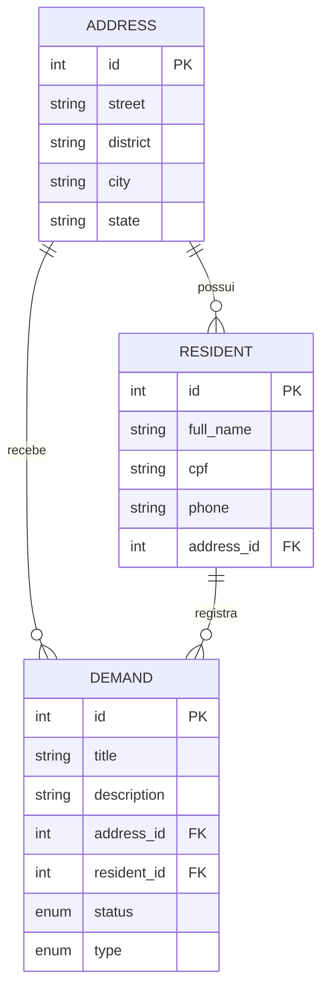

# local-demands-api

## Ideia do projeto:
Consiste em uma API que registra demandas de determinada localização.
As demandas podem ser desde problemas estruturais ate simples tarefas corriqueiras que acontecem nas localidades.
As demandas são registradas por endereço, que geralmente contam com dados detalhados como Rua, Bairro, Cidade e Estado.
Os moradores podem postar demandas em endereços distintos ao da onde moram.

## Como rodar a API:
*   Baixe o projeto
*   Recomendado criar um ambiente virtual:
```
python3 -m venv venv
```
*	Ative o ambiente virtual
(linux)
```
source ./venv/bin/activate
```
(windows)
```
./venv/scripts/activate
```
*   Com o ambiente virtual ativado, instale as dependencias:
```
pip install -r requirements.txt
```
*   Após a instalação, execute o comando:
```
python app.py
```

## Organização do projeto
A API esta organizada num modelo semelhante ao utilizado em projetos Spring Boot, ou seja, as implementações estao separadas por pastas sendo elas:
*	`config` => pasta voltada a configurações como o banco de dados em uso, assim como estabelecimento de constantes 
*	`model` => pasta onde ficam os arquivos de entidade do banco, assim como outras classes voltadas ao armazenamento das informações manipuladas.
*	`service` => pasta onde ficam as implementações das regras de negocio do projeto.
*	`repository` => pasta onde ficam as querys de manipulação do banco de dados
*	`controller` => pasta onde ficam organizadas e disponibilizadas os endpoints para acesso dos processos desenvolvidos.

## Modelagem das entidades:


### Address
Representa o endereço onde os moradores residem e onde as demandas são registradas.

| Atributo | Tipo | Obrigatório | Descrição |
| --- | --- | --- | --- |
| `id` | Integer | Sim | Identificador do endereço. |
| `street` | String | Sim | Rua do endereço. |
| `district` | String | Sim | Bairro do endereço. |
| `city` | String | Sim | Cidade do endereço. |
| `state` | String | Sim | Estado do endereço. |

### Resident
Representa o morador associado a um endereço.

| Atributo | Tipo | Obrigatório | Descrição |
| --- | --- | --- | --- |
| `id` | Integer | Sim | Identificador do morador. |
| `full_name` | String | Sim | Nome completo do morador. |
| `cpf` | String | Sim | CPF do morador. |
| `phone` | String | Sim | Telefone do morador. |
| `address_id` | Integer | Sim | Chave estrangeira para `Address`. |

### Demand
Representa uma demanda registrada por um morador em um endereço.

| Atributo | Tipo | Obrigatório | Descrição |
| --- | --- | --- | --- |
| `id` | Integer | Sim | Identificador da demanda. |
| `title` | String | Sim | Título da demanda. |
| `description` | String | Sim | Descrição da demanda. |
| `address_id` | Integer | Sim | Chave estrangeira para `Address`. |
| `resident_id` | Integer | Sim | Chave estrangeira para `Resident`. |
| `status` | Enum | Sim | Status atual da demanda; inicia como `PENDING`. |
| `type` | Enum | Sim | Tipo da demanda. |

### Relacionamentos
* Um `Address` pode estar associado a vários `Resident`.
* Um `Address` pode receber várias `Demand`.
* Um `Resident` pode registrar várias `Demand`.
* Toda `Demand` deve estar associada a um `Address` e a um `Resident`.


## Regras de negocio:
* [x] Todo morador pode postar uma demanda
* [x] A demanda, quando criada, tem que ter um morador e um endereço e status inicial de PENDENTE
* [x] Uma vez marcada como FINALIZADA, não pode ser mais alterada
* [x] O registro de endereços é sempre publico
